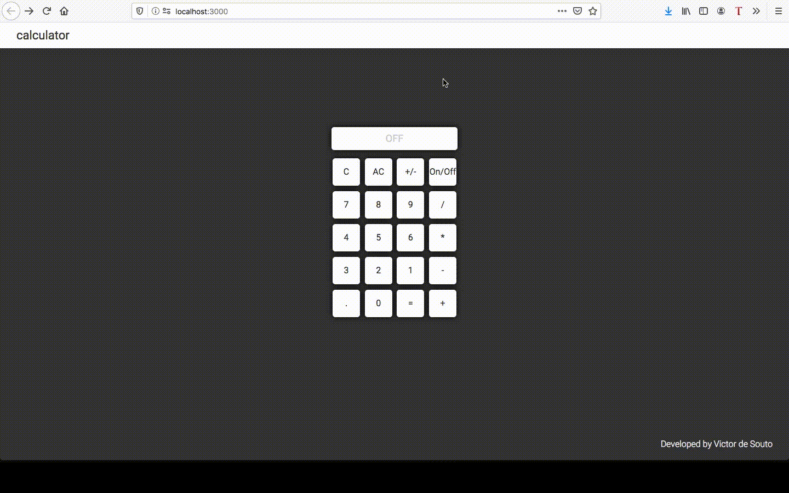

<p align="center">
<br/>

</p>

<h3 align="center">
Calculator <br/>
<h4 align="center">🔢 ReactJS Calculator</h4>
</h3>

<div align="center">

</div>

## Features

-   ⚛ReactJS - A lib to create user interfaces on web pages.
-   🔄Redux - A lib to manage the state of the app.
-   💅🏿Styled Components - One of the new ways to use CSS in modern JavaScript.

## Getting Started

```
git clone https://github.com/sudo-victor/calculator.git
cd calculator
yarn
yarn start
```
